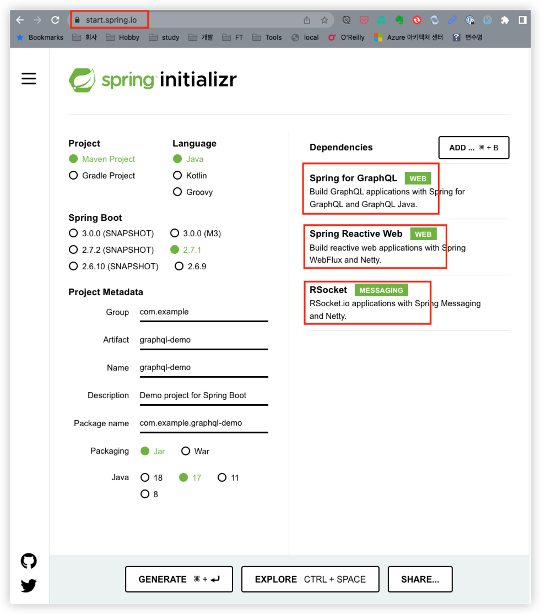
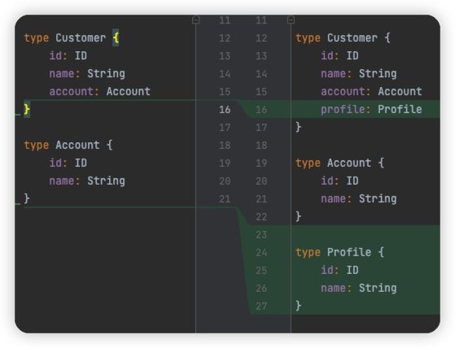
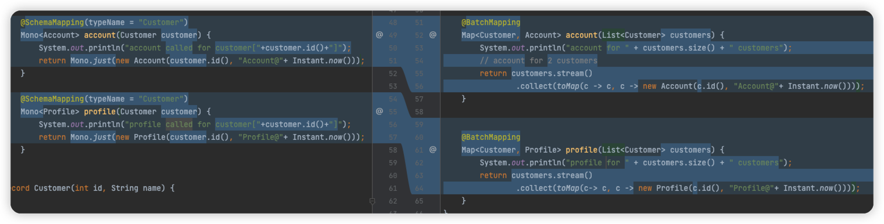

# Spring GraphQL Demo

## 0. 개요

이 글은 

- [GraphQL in Action](https://www.manning.com/books/graphql-in-action)
- [Learn Spring for GraphQL with Josh Long](https://www.youtube.com/playlist?list=PLgGXSWYM2FpNRPDQnAGfAHxMl3zUG2Run)

를 보고 정리한 예제임

### 0.1 REST API와의 차이점

- 현실 세계의 데이터를 표현하는데 가장 적합한 방법은 `Graph`

####  REST API의 문제점

1. 여러 개의 데이터 API 엔드포인트와 커뮤니케이션 해야 함
   - N/W Round Trip이 n번 발생함
   - 여러 개의 응답을 받아서 결합을 해야 함
   - 모바일 장치를 사용하는 앱을 개발할 때 큰 문제가 됨
2. 클라이언트 요청 언어가 없음
   - 무엇을 원하는지 정확하게 알릴 수 있는 언어가 없어서 서버가 반환하는 데이터를 제어할 수 없음
   - 예).
     - /resources: 전체 데이터를 읽거나
     - /resources/{id}: 지정한 id에 해당하는 데이터만 읽어야 함 
   - 특정 필드를 지정할 수 없음(projection)
     - 항상 모든 필드를 반환 -> 정보의 과잉 추출(overfetching)
   - GraphQL의 잇점
     - 클라이언트 요청 언어(GraphQL)를 통해 클라이언트가 제어권을 갖도록 해 줌 <- **Consumer Driven**
3. 버전관리
   - 코드 중복 발생
   - GraphQL의 잇점
     - 버전 관리를 할 필요가 없음
     - 그래프 구조를 가지고 있기 때문에 기존 필드를 삭제할 필요가 없이 새 필드를 새로운 노느로 추가하면 됨
   - 모바일 앱에서 더 빛을 발함
     - 모바일 앱에서는 API의 버전을 제어할 수 없기 때문

## 1. Create Project



- 위와 같이 boot 2.7 이상의 버전을 사용하고
- graphql, reactive web, rsocket 을 의존성에 추가하여 프로젝트 생성

## 2. Define GraphQL Schema

### 2.1 `src/main/resources/graphql/demo.graphqls`

- 디렉토리 이름과 확장자는 규칙을 준수해야

```graphql
type Query {
    customers: [Customer]
    customerById(id: ID!): Customer
}

type Mutation {
    addCustomer(name: String!): Customer
    updateCustomer(id: ID!, name: String!): Customer
    deleteCustomer(id: ID!): Customer
}

type Customer {
    id: ID
    name: String
    account: Account
    profile: Profile
}

type Account {
    id: ID
    name: String
}

type Profile {
    id: ID
    name: String
}
```

### 2.2 

- graphiql 활성화
- `src/main/resources/application.properties`

`spring.graphql.graphiql.enabled=true`

### 2.3 GraphQL Editor 실행하기
```java
mvn spring-boot:run
```

`http://localhost:8080/graphql` 에 접속하면 graphQL editor가 보임

## 3. Query, Mutation 메소드 구현

```java
@Controller
class CustomerController {
    private final Map<Integer, Customer> db = new ConcurrentHashMap<>();
    private final AtomicInteger id = new AtomicInteger();

    @QueryMapping
    public Flux<Customer> customers() {
        return Flux.fromIterable(db.values());
    }

    @QueryMapping
    public Mono<Customer> customerById(@Argument int id) {
        return Mono.justOrEmpty(db.get(id));
    }

    @MutationMapping
    public Mono<Customer> addCustomer(@Argument  String name) {
        var customer = new Customer(id.incrementAndGet(), name);
        db.put(customer.id(), customer);
        return Mono.just(customer);
    }
}

record Customer(int id, String name) {
}
```

## 4. @SchemaMapping 구현

```java
    @SchemaMapping(typeName = "Customer")
    Mono<Account> account(Customer customer) {
        System.out.println("account called for customer["+customer.id()+"]");
        return Mono.just(new Account(customer.id(), "Account@"+ Instant.now()));
    }

    @SchemaMapping(typeName = "Customer")
    Mono<Profile> profile(Customer customer) {
        System.out.println("profile called for customer["+customer.id()+"]");
        return Mono.just(new Profile(customer.id(), "Profile@"+ Instant.now()));
    }
```



- 지금은 customer 1명에 대해서 account, profile이 각각 1번씩 호출됨
- 즉, n명의 customer가 존재할 때 'n+1 problem'이 발생함

## 5. Apply @BatchMapping



- 이제는 n명의 customer가 존재해도 account, profile 조회는 1번씩만 호출됨

## 6. Implement Update, Delete

```java
    @MutationMapping
    public Mono<Customer> updateCustomer(@Argument int id, @Argument String name) {
        var customer = db.get(id);
        customer.updateName(name);
        return Mono.just(customer);
    }

    @MutationMapping
    public Mono<Customer> deleteCustomer(@Argument int id) {
        var customer = db.get(id);
        db.remove(id);
        return Mono.just(customer);
    }
```

```java
class Customer {
    private int id;
    private String name;

    public Customer(int id, String name) {
        this.id = id;
        this.name = name;
    }

    public int id() {
        return id;
    }

    public String name() {
        return name;
    }

    void updateName(String name) {
        this.name = name;
    }
}
```